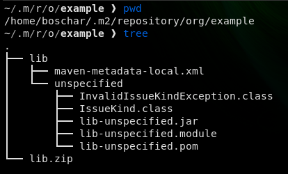

# KotlinFrontEndException - Reproducer

- Extract `lib.zip` in folder `~/.m2/repository/org/example`
- Following files should exist:



- Run `gradle build` and notice following error when compiling `src/main/kotlin/org/jetbrains/plugins/template/services/MyApplicationService.kt` due to class file `IssueKind.class`:

```
e: org.jetbrains.kotlin.util.KotlinFrontEndException: Exception while analyzing expression at (10,17) in /home/boschar/Repos/reproducer/intellij-platform-plugin-template/src/main/kotlin/org/jetbrains/plugins/template/services/MyApplicationService.kt

Attachments:
expression.kt
IssueKind.values()
        at org.jetbrains.kotlin.types.expressions.ExpressionTypingVisitorDispatcher.logOrThrowException(ExpressionTypingVisitorDispatcher.java:253)
        at org.jetbrains.kotlin.types.expressions.ExpressionTypingVisitorDispatcher.lambda$getTypeInfo$0(ExpressionTypingVisitorDispatcher.java:224)
        at org.jetbrains.kotlin.util.PerformanceCounter.time(PerformanceCounter.kt:101)
        at org.jetbrains.kotlin.types.expressions.ExpressionTypingVisitorDispatcher.getTypeInfo(ExpressionTypingVisitorDispatcher.java:164)
        at org.jetbrains.kotlin.types.expressions.ExpressionTypingVisitorDispatcher.getTypeInfo(ExpressionTypingVisitorDispatcher.java:134)
        at org.jetbrains.kotlin.types.expressions.ExpressionTypingServices.getTypeInfo(ExpressionTypingServices.java:125)
        at org.jetbrains.kotlin.resolve.calls.tower.PSICallResolver.resolveValueArgument(PSICallResolver.kt:817)
        at org.jetbrains.kotlin.resolve.calls.tower.PSICallResolver.resolveArgumentsInParenthesis(PSICallResolver.kt:753)
        at org.jetbrains.kotlin.resolve.calls.tower.PSICallResolver.toKotlinCall(PSICallResolver.kt:612)
        at org.jetbrains.kotlin.resolve.calls.tower.PSICallResolver.toKotlinCall$default(PSICallResolver.kt:588)
        at org.jetbrains.kotlin.resolve.calls.tower.PSICallResolver.runResolutionAndInference(PSICallResolver.kt:108)
        at org.jetbrains.kotlin.resolve.calls.CallResolver.doResolveCallOrGetCachedResults(CallResolver.java:601)
        at org.jetbrains.kotlin.resolve.calls.CallResolver.lambda$computeTasksAndResolveCall$0(CallResolver.java:213)
        at org.jetbrains.kotlin.util.PerformanceCounter.time(PerformanceCounter.kt:101)
        at org.jetbrains.kotlin.resolve.calls.CallResolver.computeTasksAndResolveCall(CallResolver.java:211)
        at org.jetbrains.kotlin.resolve.calls.CallResolver.computeTasksAndResolveCall(CallResolver.java:199)
        at org.jetbrains.kotlin.resolve.calls.CallResolver.resolveFunctionCall(CallResolver.java:329)
        at org.jetbrains.kotlin.resolve.calls.CallExpressionResolver.getResolvedCallForFunction(CallExpressionResolver.kt:88)
        at org.jetbrains.kotlin.resolve.calls.CallExpressionResolver.getCallExpressionTypeInfoWithoutFinalTypeCheck(CallExpressionResolver.kt:210)
        at org.jetbrains.kotlin.resolve.calls.CallExpressionResolver.getCallExpressionTypeInfo(CallExpressionResolver.kt:187)
        at org.jetbrains.kotlin.types.expressions.BasicExpressionTypingVisitor.visitCallExpression(BasicExpressionTypingVisitor.java:718)
        at org.jetbrains.kotlin.types.expressions.ExpressionTypingVisitorDispatcher.visitCallExpression(ExpressionTypingVisitorDispatcher.java:388)
        at org.jetbrains.kotlin.types.expressions.ExpressionTypingVisitorDispatcher$ForBlock.visitCallExpression(ExpressionTypingVisitorDispatcher.java:59)
        at org.jetbrains.kotlin.psi.KtCallExpression.accept(KtCallExpression.java:35)
        at org.jetbrains.kotlin.types.expressions.ExpressionTypingVisitorDispatcher.lambda$getTypeInfo$0(ExpressionTypingVisitorDispatcher.java:175)
        at org.jetbrains.kotlin.util.PerformanceCounter.time(PerformanceCounter.kt:101)
        at org.jetbrains.kotlin.types.expressions.ExpressionTypingVisitorDispatcher.getTypeInfo(ExpressionTypingVisitorDispatcher.java:164)
        at org.jetbrains.kotlin.types.expressions.ExpressionTypingVisitorDispatcher.getTypeInfo(ExpressionTypingVisitorDispatcher.java:134)
        at org.jetbrains.kotlin.types.expressions.ExpressionTypingVisitorForStatements.visitExpression(ExpressionTypingVisitorForStatements.java:512)
        at org.jetbrains.kotlin.types.expressions.ExpressionTypingVisitorForStatements.visitExpression(ExpressionTypingVisitorForStatements.java:68)
        at org.jetbrains.kotlin.psi.KtVisitor.visitReferenceExpression(KtVisitor.java:202)
        at org.jetbrains.kotlin.psi.KtVisitor.visitCallExpression(KtVisitor.java:282)
        at org.jetbrains.kotlin.psi.KtCallExpression.accept(KtCallExpression.java:35)
        at org.jetbrains.kotlin.types.expressions.ExpressionTypingVisitorDispatcher.lambda$getTypeInfo$0(ExpressionTypingVisitorDispatcher.java:175)
        at org.jetbrains.kotlin.util.PerformanceCounter.time(PerformanceCounter.kt:101)
        at org.jetbrains.kotlin.types.expressions.ExpressionTypingVisitorDispatcher.getTypeInfo(ExpressionTypingVisitorDispatcher.java:164)
        at org.jetbrains.kotlin.types.expressions.ExpressionTypingVisitorDispatcher.getTypeInfo(ExpressionTypingVisitorDispatcher.java:147)
        at org.jetbrains.kotlin.types.expressions.ExpressionTypingServices.getTypeOfLastExpressionInBlock(ExpressionTypingServices.java:406)
        at org.jetbrains.kotlin.types.expressions.ExpressionTypingServices.getBlockReturnedTypeWithWritableScope(ExpressionTypingServices.java:327)
        at org.jetbrains.kotlin.types.expressions.ExpressionTypingServices.getBlockReturnedType(ExpressionTypingServices.java:206)
        at org.jetbrains.kotlin.types.expressions.ExpressionTypingServices.getBlockReturnedType(ExpressionTypingServices.java:183)
        at org.jetbrains.kotlin.types.expressions.ExpressionTypingVisitorForStatements.visitBlockExpression(ExpressionTypingVisitorForStatements.java:555)
        at org.jetbrains.kotlin.types.expressions.ExpressionTypingVisitorForStatements.visitBlockExpression(ExpressionTypingVisitorForStatements.java:68)
        at org.jetbrains.kotlin.psi.KtBlockExpression.accept(KtBlockExpression.java:79)
        at org.jetbrains.kotlin.types.expressions.ExpressionTypingVisitorDispatcher.lambda$getTypeInfo$0(ExpressionTypingVisitorDispatcher.java:175)
        at org.jetbrains.kotlin.util.PerformanceCounter.time(PerformanceCounter.kt:101)
        at org.jetbrains.kotlin.types.expressions.ExpressionTypingVisitorDispatcher.getTypeInfo(ExpressionTypingVisitorDispatcher.java:164)
        at org.jetbrains.kotlin.types.expressions.ExpressionTypingVisitorDispatcher.getTypeInfo(ExpressionTypingVisitorDispatcher.java:147)
        at org.jetbrains.kotlin.types.expressions.ExpressionTypingServices.getTypeInfo(ExpressionTypingServices.java:120)
        at org.jetbrains.kotlin.types.expressions.ExpressionTypingServices.getTypeInfo(ExpressionTypingServices.java:95)
        at org.jetbrains.kotlin.resolve.BodyResolver.resolveAnonymousInitializer(BodyResolver.java:714)
        at org.jetbrains.kotlin.resolve.BodyResolver.resolveAnonymousInitializers(BodyResolver.java:697)
        at org.jetbrains.kotlin.resolve.BodyResolver.resolveBehaviorDeclarationBodies(BodyResolver.java:124)
        at org.jetbrains.kotlin.resolve.BodyResolver.resolveBodies(BodyResolver.java:255)
        at org.jetbrains.kotlin.resolve.LazyTopDownAnalyzer.analyzeDeclarations(LazyTopDownAnalyzer.kt:227)
        at org.jetbrains.kotlin.resolve.LazyTopDownAnalyzer.analyzeDeclarations$default(LazyTopDownAnalyzer.kt:58)
        at org.jetbrains.kotlin.cli.jvm.compiler.TopDownAnalyzerFacadeForJVM.analyzeFilesWithJavaIntegration(TopDownAnalyzerFacadeForJVM.kt:130)
        at org.jetbrains.kotlin.cli.jvm.compiler.TopDownAnalyzerFacadeForJVM.analyzeFilesWithJavaIntegration$default(TopDownAnalyzerFacadeForJVM.kt:99)
        at org.jetbrains.kotlin.cli.jvm.compiler.KotlinToJVMBytecodeCompiler$analyze$1.invoke(KotlinToJVMBytecodeCompiler.kt:301)
        at org.jetbrains.kotlin.cli.jvm.compiler.KotlinToJVMBytecodeCompiler$analyze$1.invoke(KotlinToJVMBytecodeCompiler.kt:55)
        at org.jetbrains.kotlin.cli.common.messages.AnalyzerWithCompilerReport.analyzeAndReport(AnalyzerWithCompilerReport.kt:113)
        at org.jetbrains.kotlin.cli.jvm.compiler.KotlinToJVMBytecodeCompiler.analyze(KotlinToJVMBytecodeCompiler.kt:292)
        at org.jetbrains.kotlin.cli.jvm.compiler.KotlinToJVMBytecodeCompiler.compileModules$cli(KotlinToJVMBytecodeCompiler.kt:102)
        at org.jetbrains.kotlin.cli.jvm.compiler.KotlinToJVMBytecodeCompiler.compileModules$cli$default(KotlinToJVMBytecodeCompiler.kt:60)
        at org.jetbrains.kotlin.cli.jvm.K2JVMCompiler.doExecute(K2JVMCompiler.kt:172)
        at org.jetbrains.kotlin.cli.jvm.K2JVMCompiler.doExecute(K2JVMCompiler.kt:54)
        at org.jetbrains.kotlin.cli.common.CLICompiler.execImpl(CLICompiler.kt:91)
        at org.jetbrains.kotlin.cli.common.CLICompiler.execImpl(CLICompiler.kt:43)
        at org.jetbrains.kotlin.cli.common.CLITool.exec(CLITool.kt:93)
        at org.jetbrains.kotlin.incremental.IncrementalJvmCompilerRunner.runCompiler(IncrementalJvmCompilerRunner.kt:471)
        at org.jetbrains.kotlin.incremental.IncrementalJvmCompilerRunner.runCompiler(IncrementalJvmCompilerRunner.kt:123)
        at org.jetbrains.kotlin.incremental.IncrementalCompilerRunner.compileIncrementally(IncrementalCompilerRunner.kt:367)
        at org.jetbrains.kotlin.incremental.IncrementalCompilerRunner.compileIncrementally$default(IncrementalCompilerRunner.kt:309)
        at org.jetbrains.kotlin.incremental.IncrementalCompilerRunner.compileImpl$rebuild(IncrementalCompilerRunner.kt:115)
        at org.jetbrains.kotlin.incremental.IncrementalCompilerRunner.compileImpl(IncrementalCompilerRunner.kt:167)
        at org.jetbrains.kotlin.incremental.IncrementalCompilerRunner.compile(IncrementalCompilerRunner.kt:77)
        at org.jetbrains.kotlin.daemon.CompileServiceImplBase.execIncrementalCompiler(CompileServiceImpl.kt:623)
        at org.jetbrains.kotlin.daemon.CompileServiceImplBase.access$execIncrementalCompiler(CompileServiceImpl.kt:101)
        at org.jetbrains.kotlin.daemon.CompileServiceImpl.compile(CompileServiceImpl.kt:1718)
        at java.base/jdk.internal.reflect.NativeMethodAccessorImpl.invoke0(Native Method)
        at java.base/jdk.internal.reflect.NativeMethodAccessorImpl.invoke(NativeMethodAccessorImpl.java:62)
        at java.base/jdk.internal.reflect.DelegatingMethodAccessorImpl.invoke(DelegatingMethodAccessorImpl.java:43)
        at java.base/java.lang.reflect.Method.invoke(Method.java:566)
        at java.rmi/sun.rmi.server.UnicastServerRef.dispatch(UnicastServerRef.java:359)
        at java.rmi/sun.rmi.transport.Transport$1.run(Transport.java:200)
        at java.rmi/sun.rmi.transport.Transport$1.run(Transport.java:197)
        at java.base/java.security.AccessController.doPrivileged(Native Method)
        at java.rmi/sun.rmi.transport.Transport.serviceCall(Transport.java:196)
        at java.rmi/sun.rmi.transport.tcp.TCPTransport.handleMessages(TCPTransport.java:562)
        at java.rmi/sun.rmi.transport.tcp.TCPTransport$ConnectionHandler.run0(TCPTransport.java:796)
        at java.rmi/sun.rmi.transport.tcp.TCPTransport$ConnectionHandler.lambda$run$0(TCPTransport.java:677)
        at java.base/java.security.AccessController.doPrivileged(Native Method)
        at java.rmi/sun.rmi.transport.tcp.TCPTransport$ConnectionHandler.run(TCPTransport.java:676)
        at java.base/java.util.concurrent.ThreadPoolExecutor.runWorker(ThreadPoolExecutor.java:1128)
        at java.base/java.util.concurrent.ThreadPoolExecutor$Worker.run(ThreadPoolExecutor.java:628)
        at java.base/java.lang.Thread.run(Thread.java:829)
Caused by: java.lang.IllegalStateException: Could not read class VirtualFile: /home/boschar/.m2/repository/org/example/lib/unspecified/lib-unspecified.jar!/com/axivion/client_data_processing/issue_data_source/IssueKind.class
        at org.jetbrains.kotlin.load.java.structure.impl.classFiles.BinaryJavaClass.<init>(BinaryJavaClass.kt:126)
        at org.jetbrains.kotlin.load.java.structure.impl.classFiles.BinaryJavaClass.<init>(BinaryJavaClass.kt:34)
        at org.jetbrains.kotlin.cli.jvm.compiler.KotlinCliJavaFileManagerImpl.findClass(KotlinCliJavaFileManagerImpl.kt:130)
        at org.jetbrains.kotlin.resolve.jvm.KotlinJavaPsiFacade$CliFinder.findClass(KotlinJavaPsiFacade.java:492)
        at org.jetbrains.kotlin.resolve.jvm.KotlinJavaPsiFacade.findClass(KotlinJavaPsiFacade.java:190)
        at org.jetbrains.kotlin.load.java.JavaClassFinderImpl.findClass(JavaClassFinderImpl.kt:44)
        at org.jetbrains.kotlin.load.java.lazy.descriptors.LazyJavaPackageScope$classes$1.invoke(LazyJavaPackageScope.kt:76)
        at org.jetbrains.kotlin.load.java.lazy.descriptors.LazyJavaPackageScope$classes$1.invoke(LazyJavaPackageScope.kt:54)
        at org.jetbrains.kotlin.storage.LockBasedStorageManager$MapBasedMemoizedFunction.invoke(LockBasedStorageManager.java:578)
        at org.jetbrains.kotlin.load.java.lazy.descriptors.LazyJavaPackageScope.findClassifier(LazyJavaPackageScope.kt:142)
        at org.jetbrains.kotlin.load.java.lazy.descriptors.LazyJavaPackageScope.getContributedClassifier(LazyJavaPackageScope.kt:132)
        at org.jetbrains.kotlin.load.java.lazy.descriptors.JvmPackageScope.getContributedClassifier(JvmPackageScope.kt:55)
        at org.jetbrains.kotlin.resolve.scopes.ChainedMemberScope.getContributedClassifier(ChainedMemberScope.kt:35)
        at org.jetbrains.kotlin.resolve.scopes.AbstractScopeAdapter.getContributedClassifier(AbstractScopeAdapter.kt:44)
        at org.jetbrains.kotlin.resolve.LazyExplicitImportScope.getContributedClassifier(LazyExplicitImportScope.kt:45)
        at org.jetbrains.kotlin.resolve.lazy.LazyImportScope$getClassifier$1.invoke(LazyImportScope.kt:266)
        at org.jetbrains.kotlin.resolve.lazy.LazyImportScope$getClassifier$1.invoke(LazyImportScope.kt:261)
        at org.jetbrains.kotlin.storage.LockBasedStorageManager.compute(LockBasedStorageManager.java:290)
        at org.jetbrains.kotlin.resolve.lazy.LazyImportScope.getClassifier(LazyImportScope.kt:261)
        at org.jetbrains.kotlin.resolve.lazy.LazyImportScope.getContributedClassifier(LazyImportScope.kt:257)
        at org.jetbrains.kotlin.resolve.scopes.ResolutionScope$DefaultImpls.getContributedClassifierIncludeDeprecated(ResolutionScope.kt:40)
        at org.jetbrains.kotlin.resolve.scopes.HierarchicalScope$DefaultImpls.getContributedClassifierIncludeDeprecated(Scopes.kt:27)
        at org.jetbrains.kotlin.resolve.scopes.ImportingScope$DefaultImpls.getContributedClassifierIncludeDeprecated(Scopes.kt:113)
        at org.jetbrains.kotlin.resolve.lazy.LazyImportScope.getContributedClassifierIncludeDeprecated(LazyImportScope.kt:222)
        at org.jetbrains.kotlin.resolve.calls.tower.TowerLevelsKt.getContributedObjectVariablesIncludeDeprecated(TowerLevels.kt:529)
        at org.jetbrains.kotlin.resolve.calls.tower.TowerLevelsKt.access$getContributedObjectVariablesIncludeDeprecated(TowerLevels.kt:1)
        at org.jetbrains.kotlin.resolve.calls.tower.ScopeBasedTowerLevel.getObjects(TowerLevels.kt:342)
        at org.jetbrains.kotlin.resolve.calls.tower.ScopeTowerProcessorsKt$createVariableAndObjectProcessor$1.invoke(ScopeTowerProcessors.kt:249)
        at org.jetbrains.kotlin.resolve.calls.tower.ScopeTowerProcessorsKt$createVariableAndObjectProcessor$1.invoke(ScopeTowerProcessors.kt:249)
        at org.jetbrains.kotlin.resolve.calls.tower.NoExplicitReceiverScopeTowerProcessor.simpleProcess(ScopeTowerProcessors.kt:152)
        at org.jetbrains.kotlin.resolve.calls.tower.SimpleScopeTowerProcessor$DefaultImpls.process(ScopeTowerProcessors.kt:60)
        at org.jetbrains.kotlin.resolve.calls.tower.AbstractSimpleScopeTowerProcessor.process(ScopeTowerProcessors.kt:63)
        at org.jetbrains.kotlin.resolve.calls.tower.PrioritizedCompositeScopeTowerProcessor.process(ScopeTowerProcessors.kt:38)
        at org.jetbrains.kotlin.resolve.calls.tower.TowerResolver.processTowerData(TowerResolver.kt:380)
        at org.jetbrains.kotlin.resolve.calls.tower.TowerResolver.access$processTowerData(TowerResolver.kt:92)
        at org.jetbrains.kotlin.resolve.calls.tower.TowerResolver$Task.process(TowerResolver.kt:204)
        at org.jetbrains.kotlin.resolve.calls.tower.TowerResolver$Task.processImplicitReceiver(TowerResolver.kt:339)
        at org.jetbrains.kotlin.resolve.calls.tower.TowerResolver$Task.run$processLexicalScope(TowerResolver.kt:247)
        at org.jetbrains.kotlin.resolve.calls.tower.TowerResolver$Task.run$processScopes(TowerResolver.kt:277)
        at org.jetbrains.kotlin.resolve.calls.tower.TowerResolver$Task.run(TowerResolver.kt:302)
        at org.jetbrains.kotlin.resolve.calls.tower.TowerResolver.run(TowerResolver.kt:111)
```
